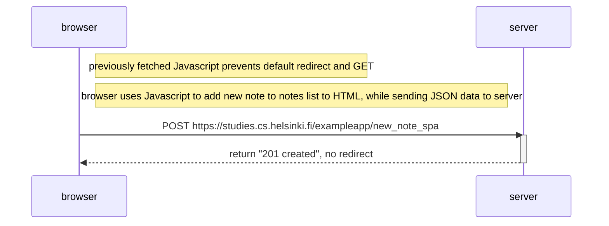

# Exercise 0.6: SPA note adding diagram

```mermaid
sequenceDiagram
    participant browser
    participant server
    Note right of browser: previously fetched Javascript prevents default redirect and GET
    Note right of browser: browser uses Javascript to add new note to notes list to HTML, while sending JSON data to server
    browser->>server: POST https://studies.cs.helsinki.fi/exampleapp/new_note_spa
    activate server
    server-->>browser: return "201 created", no redirect
    deactivate server
```